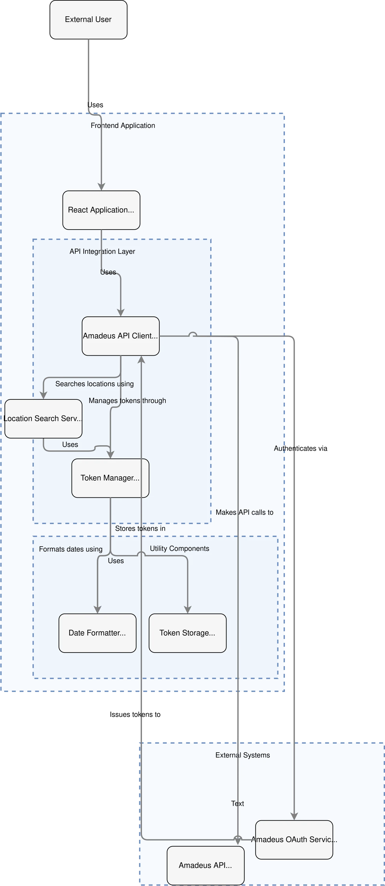

# La aplicación utiliza react JS para inicializarse:
* Para realizar el clone del código es necesario utilizar "git clone" y la url del repositorio de GITHUB
* Se deben instalar las dependencias "npm install" en terminal
* Para iniciar el comando es "npm run dev"

La API maneja 2 entornos, uno para dev o testear y uno para producción.
En esta ocasión se manejó el entorno de producción, para cambiar de entornos hay que modificar la URL base:

dev o tester = 'https://test.api.amadeus.com';
producción = 'https://api.amadeus.com';

# Sistema de Búsqueda de Ubicaciones con Amadeus API.
Esta aplicación que utiliza la API Amadeus API para buscar ubicaciones y gestionar tokens de autenticación. 
El objetivo es ofrecer una experiencia eficiente y segura para los usuarios.

# Descripción General.
La aplicación está diseñada para que los usuarios realicen búsquedas de ubicaciones a través de una interfaz web desarrollada con React. 
Detrás de escena, el sistema se encarga de gestionar las llamadas a la Amadeus API, la autenticación mediante OAuth y el manejo de tokens.

# Componentes del Sistema

1. Usuario Externo
Es el punto de inicio del flujo. Los usuarios interactúan con la aplicación para realizar búsquedas de ubicaciones.
2. Aplicación Frontend
Interfaz en React: Permite a los usuarios realizar búsquedas y visualizar los resultados.
Capa de integración con API: Conecta la interfaz con los servicios externos, procesando las solicitudes y respuestas.
3. Servicios Backend
Amadeus API Client: Es el cliente que realiza las llamadas directas a la Amadeus API.
Location Search Service: Servicio encargado de procesar las búsquedas de ubicaciones.
Token Manager: Administra los tokens de autenticación requeridos para interactuar con la API.
Date Formatter: Formatea las fechas en los datos que se envían o reciben.
4. Sistemas Externos
Amadeus OAuth Service: Proporciona los tokens de autenticación necesarios para acceder a la API.
Amadeus API: Ofrece los datos y servicios requeridos para las búsquedas.
Flujo de Trabajo
El usuario accede a la aplicación React y realiza una búsqueda.
La solicitud se envía al Location Search Service, que se encarga de gestionar el proceso.
El Token Manager verifica si hay un token válido disponible:
Si no lo hay, solicita un nuevo token al Amadeus OAuth Service.
Una vez autenticado, el Amadeus API Client realiza la búsqueda en la Amadeus API.
Los datos recibidos son procesados:
Las fechas se formatean con Date Formatter.
Los tokens se almacenan en Token Storage para futuras solicitudes.
Los resultados se envían a la interfaz React para mostrarlos al usuario.
Consideraciones Finales
Este flujo está diseñado para ser modular, lo que facilita su mantenimiento y escalabilidad. 
Además, se prioriza la seguridad al gestionar los tokens y la interacción con servicios externos.

# Próximas mejoras.
1. Mejorar el manejo de errores para casos de fallos en la autenticación o búsqueda.
2. Optimizar el almacenamiento de tokens para mayor seguridad.
3. Agregar funcionalidades adicionales de la Amadeus API.
4. Mejorar diseño intuitivo UX / UI
5. Agregar el autocompletado en el input